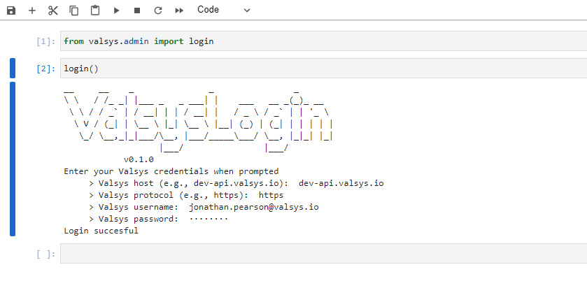

# Getting started
## Create a python virtual environment
We recommended to install the `valsys` library into a python virtual (local) environment, rather than into the global python environment. This requires you have a system-wide installation of `python` (below we assume that `python` corresponds to a `>=3.6`.). Other environment management systems are available.

To create a python virtual environment in the current directory, execute
```
python -m venv .venv
```
The activation of the virtual environment is slightly different on windows and mac:

* If on windows,
```
.venv\Scripts\activate.ps1
```
* If on linux/mac
```
source .venv/bin/activate
```
## Installing the `valsys` package
Now that you have an active virtual environment, install the `valsys` python package via
```python
pip install git+https://github.com/valsysinc/valsys-api
```
Any other packages you require (e.g., `spark`, or `numpy`) will also need to be installed into the environment

## Login
Once the library has been installed, the first task is to login. From a python script (e.g., in the repl, or a jupyter notebook), execute
```python
from valsys.admin import login
login()
```

Alternatively, you could execute the following on a command line
```
python main.py --login
```

Either way, you will be prompted to enter the following information:

* **Valsys host**: the base part of the valsys url (if unsure, contact valsys support)
* **Valsys protocol**: whether using `http` or `https`.
* **Valsys username**: this is the username used to login to the valsys system 
* **Valsys password**: this is the password used to login to the valsys system

The login process will attempt to authenticate with these pieces of information.

Below we provide a screenshot of a jupyter notebook showing the expected screen and output.

