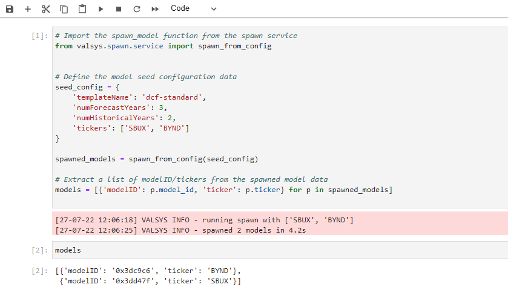

# Workflow examples

This is a collection of examples of how to use the Valsys library.

## Spawn a model
This workflow allows a model to be spawned from a template.

In the below example, we show how to spawn a `SBUX` model and obtain its model `uid`. 


```python linenums="1"
# Import the spawn_model function from the spawn service
from valsys.spawn.service import spawn_from_config


# Define the model seed configuration data
seed_config = {
    'templateName': 'dcf-standard',
    'numForecastYears': 3,
    'numHistoricalYears': 2,
    'tickers': ['SBUX', 'BYND']
}

spawned_models = spawn_from_config(seed_config)

# Extract a list of modelID/tickers from the spawned model data
models = [{'modelID': p.model_id, 'ticker': p.ticker} for p in spawned_models]
```

If the `templateName` is incorrectly entered (e.g., typo, or something that doesnt exist), a `TemplateNotFoundException` is thrown explaining 
```
TemplateNotFoundException: template not found for template_name: dcf-standard2
```

Below is a screenshot from a jupyter notebook of exactly this process, the output, and a printout of the `models` built information.


## Append tags to an existing model
Tags can be added or appended to existing models; this assumes knowledge of the models `uid`.
```python linenums="1" 
# Import the append_tags function from the modeling service
from valsys.modeling.service import append_tags

# Define the models uid
model_uid = "0xe50deb"

# Define the tags to be appended to the model
tags_to_append = ["t5", "t4"]

# Append the tags
append_tags(model_uid, tags_to_append)
```

## Share a model
The API allows a model to be shared to another user. This is done by referencing the modelsID, the email of the user the model is to be shared with, and the permissions that the user will have over the model.
### With a single user
```python linenums="1"
# Import the share_model function from the modeling service
from valsys.modeling.service import share_model

# Import the permissions types 
from valsys.modeling.models import Permissions

# Define the models uid
model_uid = "0xe50deb"

# Define the email of the user the model is to be shared with
email_to_share_to = "jack.fuller@valsys.io"

# Define the permissions for the user
permission = Permissions.VIEW

# Share the model
share_model(model_uid, email_to_share_to, permission=permission)
```
A model can only be shared with a given user once. Violating this will result in a `ShareModelException`.
### With multiple user and different permissions
```python linenums="1"
# Import the share_model function from the modeling service
from valsys.modeling.service import share_model

# Import the permissions types 
from valsys.modeling.models import Permissions

# Define the models uid
model_uid = "0xe50deb"

# Define the list of emails of the users the model is to be shared with;
# note that we are allowed to put different permissions per user.
users = [
    ("jack.fuller@valsys.io", Permissions.VIEW),
    ("simon.bessey@valsys.io", Permissions.EDIT)
]

# Share the model
for email, permission in users:
    share_model(model_uid, email, permission=permission)
```

## Obtain module information for a model

It will be common to need module information: for example, moduleIDs.

This workflow shows how to obtain the module meta data for a model. Crucially, this shows the module hierarchy, as well as the module IDs and names.

```python linenums="1"
from valsys.modeling.service import pull_model_information, pull_case

model_uid = "0xe50deb"

first_case_info = pull_model_information(model_uid).first
case = pull_case(first_case_info.uid)
module_info = case.module_meta
```
will result in `module_info` being something like
```json linenums="1"
[
    {
        "name": "DCF", 
        "uid": "0xe50c46", 
        "children": [
            {
                "name": "Balance Sheet", 
                "uid": "0xe50dbd", 
                "children": [
                    {
                        "name": "Equity", 
                        "uid": "0xe50cd3", 
                        "children": []
                    }, 
                    {
                        "name": "Liabilities", 
                        "uid": "0xe50d22", 
                        "children": []
                    }, 
                ]
            }, 
            {
                "name": "DCF Drivers", 
                "uid": "0xe50fe6", 
                "children": []
            }, 
            {
                "name": "Income Statement", 
                "uid": "0xe510a8", 
                "children": [
                    {
                        "name": "Earnings Per Share", 
                        "uid": "0xe50c5f", 
                        "children": []
                    }, 
                    {
                        "name": "Operating Income", 
                        "uid": "0xe50cf8", 
                        "children": []
                    }, 
                ]
            },
            {
                "name": "Cash Flow statement", 
                "uid": "0xe51235", 
                "children": [
                    {
                        "name": "Cash Flow From Operating Activities", 
                        "uid": "0xe50c1b", 
                        "children": []
                    }
                ]
            }
        ]
    }
]

```
Note that the nested structure highlights the modules parent-child relationship. Each modules `name`, `uid`, and `children` modules are returned.

## Add child module to existing module
Adding a child module requires knowledge of the parent modules `uid`.
```python linenums="1"
# Import the add_child_module function from the modeling service
from valsys.modeling.service import add_child_module, pull_model_information

# Define the model id
model_id = '0xe50deb'

# Define the id of the parent module
parent_module_id = '0xe51235'

# Define the name of the new module
new_module_name = 'new module'

# Go get the case uid for the model
case_id = pull_model_information(model_id).first.uid

# Use the above data to add a child module
new_module = add_child_module(
    parent_module_id = parent_module_id, 
    name = new_module_name, 
    model_id = model_id, 
    case_id = case_id)
```

## Add line item to a module
This workflow allows a line item to be added to an existing module; it requires knowledge of the `modelID`, and `moduleID`. One must provide the `name` of the new line item, and the `order` of the line item in the module.
```python linenums="1"
# Import the add_line_item function from the modeling service
from valsys.modeling.service import add_line_item, pull_model_information

# Define the modelID
model_id = '0xe50deb'

# Define the module ID of the module the line item is to be added to
module_id = '0xe51235'

# Define the name of the new line item
line_item_name = 'new line item'

# Define the order in the module of the new line item
line_item_order = 10

# Get the caseID from the modelID
case_id = pull_model_information(model_id).first.uid

# Add the new line item, which returns a new line line object.
new_line_item = add_line_item(
    model_id = model_id, 
    case_id = case_id, 
    module_id = module_id, 
    name = line_item_name, 
    order = line_item_order)
```
Note that adding the same line item multiple times will result in an error.